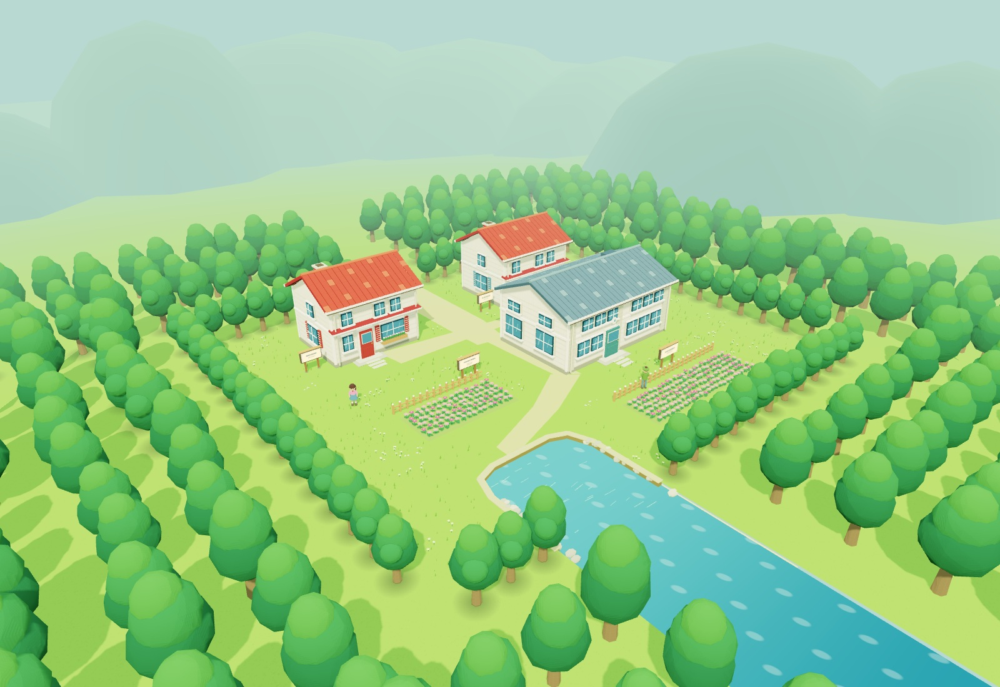
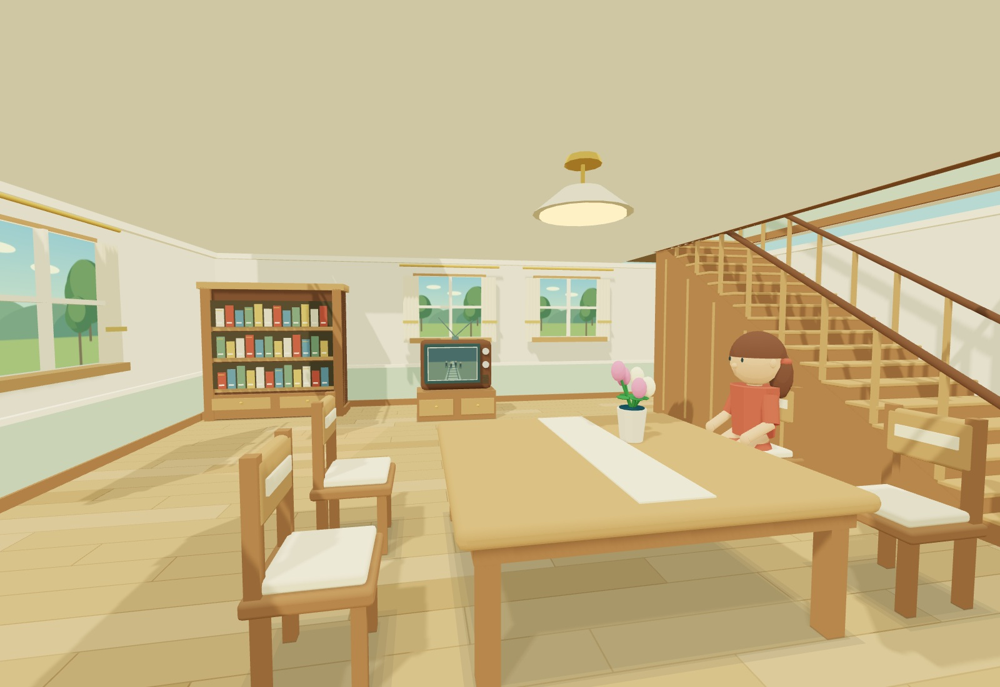
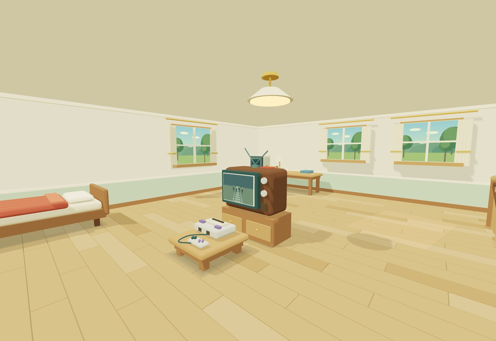
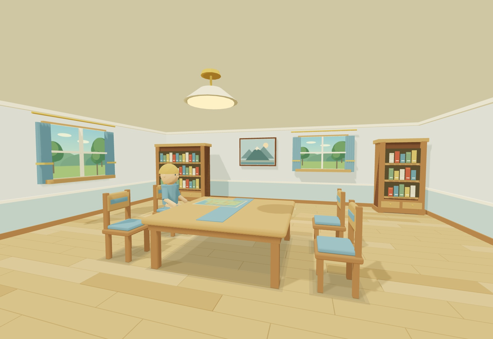
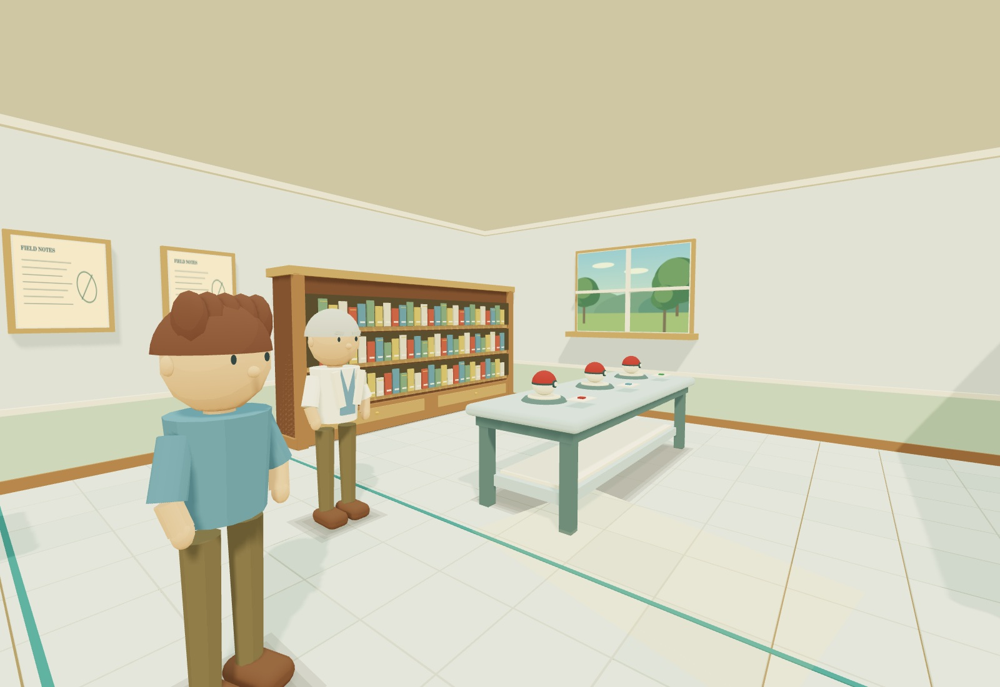

# Pokered — Kanto VR

**New: all five Viridian City interiors**, furnished in the existing Pallet style.
Walk north from Pallet, or [start in Viridian](https://permabulk69420-pixel.github.io/Pokered/?start=viridian).
Walk through the open doors to explore the Pokémon Center, Mart, school,
nickname house and Gym. Layouts follow the original Red/Blue room maps, with
Pallet's warm woodwork, furnishings and doorway fade. This is an environment
pass: services, new NPCs and moving Gym arrows are not implemented.
See [interior details and previews](docs/VIRIDIAN_INTERIORS.md) and
[the earlier exterior pass](docs/VIRIDIAN.md).

The original Pallet build notes follow.

A small, standalone Three.js / WebXR remaster study of Pokémon Red's Pallet Town,
intended for Meta Quest 3. Explore the town, both floors of Red's house, Blue's
house, and Oak's laboratory. No ROM or emulator is needed.

## Play

Open [Pallet Town VR](https://permabulk69420-pixel.github.io/Pokered/) in
**Meta Quest Browser** and select **Enter VR**.

| Input | Action |
| --- | --- |
| Left thumbstick | Head-relative smooth walking |
| Right thumbstick | Smooth turning, about 83°/second at full deflection |
| Left thumbstick click | Jog while moving |
| WASD / up and down arrows | Desktop walking |
| Mouse | Desktop looking; click the scene to capture the mouse |
| Q/E / left and right arrows | Desktop smooth turning |
| Shift | Desktop jogging |
| Escape / Menu | Release the mouse / return to the overview |
| Touchscreen | Left virtual stick to move; drag the scene to look |

The town loads directly into the overview. Nothing needs to be imported to see it.
Walls, signs, fences, residents, the tree perimeter, and the water's edge stop
thumbstick/keyboard movement. **Walk through the open front doors to enter.** A
short fade covers the transfer to each interior in both VR eyes. Walk back through
the entrance to leave. No grabbing, button press, or hand model is required.

Red's stairs are in the northeast corner. Walk onto them from the south, climb
to the north landing, then turn left into the bedroom. They work in both directions.
The treads use a continuous walking ramp, with slower movement on the flight and
guardrails around the opening. Tracked eye height and crouching remain independent
of the virtual floor. Blue's house and Oak's lab have one accessible floor, as in Red.

Furniture and residents are currently visual only. Dialogue, grabbing, working
doors, starter selection, and adjoining routes are for later mechanics passes.

## What is faithful, and what is interpreted

The original Red/Blue **20 × 18 movement-tile** plan provides the placement of the
two northern houses, the southeastern lab, four signs, two flower plots, the
central Route 1 opening, and the southwestern water inlet. The original sign and
door tile coordinates are retained in the layout reference.

Two metres per tile gives a roughly **40 × 36 metre** town. Building footprints
are adapted slightly for walkable clearances and plausible doors and storeys.
White siding, warm red house roofs, slate laboratory roofing, subtle grass trails,
side/rear windows, vegetation, and distant hills are this remaster's interpretation
of details that the monochrome map cannot specify. The original map is a reference,
not a texture pasted into the world. The project authors its own geometry and
materials; it does not bundle Nintendo's sprites, textures, ROM, or soundtrack.

The indoor layouts were checked against the original **Red/Blue block maps**,
not FireRed or Yellow. The houses retain their 8 × 8 plans, and the lab its
10 × 12 plan, at an interpreted 1.2 metres per indoor tile. Like the original
game, indoors are separate spaces; this preserves the exterior you can walk around
and gives the rooms usable clearances. Red's one-tile stair symbol becomes a real
1.62-metre-wide flight with 18 treads, a 3.05-metre rise, and a north landing.

| Room | Details carried across from Red/Blue |
| --- | --- |
| Red's ground floor | Northwest bookcases, north-wall TV, central table and four chairs, Mom, northeast stairs, south entrance mat |
| Red's bedroom | Northwest PC and writing desk, central TV and console, southwest bed, southeast plant, northeast stair landing |
| Blue's house | Northern bookcases, landscape picture and window, table with town map, seated Daisy, two southern plants |
| Oak's lab | Northwest computer, instrument and two Pokédexes, northeast books, east table with three Poké Balls, split southern book banks, Oak, Blue and three aides |

Oak's room is staged with all three starters still on the table; characters do
not yet change with story progress. Woodwork, upholstery, daylight, ceilings,
rails and clearances are remaster interpretations. Window views are lightweight
illustrated scenery, rather than additional live render passes.

References:

- [Original object, sign and door positions](https://github.com/pret/pokered/blob/master/data/maps/objects/PalletTown.asm)
- [Original Pallet Town block map](https://github.com/pret/pokered/blob/master/maps/PalletTown.blk)
- [Pallet Town geography and original map comparison](https://bulbapedia.bulbagarden.net/wiki/Pallet_Town)
- [Red's ground-floor map](https://github.com/pret/pokered/blob/master/maps/RedsHouse1F.blk) and [objects](https://github.com/pret/pokered/blob/master/data/maps/objects/RedsHouse1F.asm)
- [Red's bedroom map](https://github.com/pret/pokered/blob/master/maps/RedsHouse2F.blk)
- [Blue's house map](https://github.com/pret/pokered/blob/master/maps/BluesHouse.blk) and [objects](https://github.com/pret/pokered/blob/master/data/maps/objects/BluesHouse.asm)
- [Oak's lab map](https://github.com/pret/pokered/blob/master/maps/OaksLab.blk) and [objects](https://github.com/pret/pokered/blob/master/data/maps/objects/OaksLab.asm)

## Hand model slot

Put your GLBs into **`public/assets/hands/`**, then fill in `left` and `right` in
**`hands.json`**. That folder's README explains scale, orientation and offsets.
The empty slots already work with small grip markers. Models load automatically
and attach to the controller grip for the correct hand. There is no file picker.
Finger animation and optical hand tracking are not implemented yet.

## Development

Requires Node 22.12 or newer.

```sh
npm ci
npm run dev
npm test
npm run build
```

`dist/` is the static deployment output. Relative asset paths support a repository
subdirectory on GitHub Pages. The Pages workflow builds and publishes `main`.
Keep the repository's Pages source set to **GitHub Actions** when using that workflow.

| File | Responsibility |
| --- | --- |
| `src/world/layout.js` | Town identity, map coordinates, building/sign/garden positions, exit stubs |
| `src/world/buildings.js` | Reusable exterior architecture, independent door hinges |
| `src/world/landscape.js` | Ground, shoreline, instanced plants and trees, sky |
| `src/world/residents.js` | The two visual-only residents, each in a named group |
| `src/world/pallet-town.js` | Town assembly, lighting and collision descriptions |
| `src/world/interiors/layout.js` | Room dimensions, stair geometry parameters and doorway thresholds |
| `src/world/interiors/rooms.js` | Furnished room assembly, floor openings, lighting and collision descriptions |
| `src/world/interiors/props.js` | Reusable furniture, computers, console, Poké Balls and residents |
| `src/world/interiors/materials.js` | Indoor palette and authored canvas artwork |
| `src/world/spaces.js` | Active space, automatic entrances and the stereo doorway fade |
| `src/xr/locomotion.js` | Desktop, touch and Quest movement; tracked-head turning pivot |
| `src/xr/collision.js` | Shared horizontal collision/slide logic |
| `src/xr/navigation.js` | Continuous stair elevation, floor-specific obstacles and edge protection |
| `src/xr/hands.js` | Optional GLB hand loading, independent of the town |
| `src/main.js` | Renderer, start screen, session lifecycle and frame loop |

## Rendering choices

- Geometry is merged by material within each building; door hinges stay separate.
- Trees, grass, stems and flowers use instancing. Grass needs no alpha texture.
- Only one space and its lights render at a time. Rooms are constructed at startup
  so crossing a doorway does not need a model download or geometry build.
- The town uses a static 2048px shadow atlas; each interior uses a static 1024px
  atlas. Shadows refresh on space changes and are reused during walking.
- Simple opaque animated water; no reflections pass, bloom, SSAO or full-screen outline pass.
- Quest requests a 72 Hz session when available, with fixed foveation at 0.7.
- The town is roughly 300,000 triangles before view culling. Red's complete
  two-storey interior is about 24,500; Blue's is 13,100; Oak's is 30,300. These are
  geometry counts, **not measured Quest framerates**.
- JavaScript is bundled locally. The only external visual dependency is optional
  Google Fonts for the desktop start screen; system fonts are the fallback.

Append `?debug` for scene statistics. `?view=home`, `?view=lab`, `?view=shore`,
`?view=map`, and `?view=walk` provide convenient inspection views. Add `&clean`
to hide the interface for screenshots.

Indoor inspection views: `?view=red-interior`, `?view=bedroom`,
`?view=blue-interior`, `?view=lab-interior`, and `?view=starters`.

The static room batches retain named furnishing anchors and their transforms.
When adding grabbing or animation, build that prop separately from the static
batch using the reusable prop builders. The existing GLB hand slots are ready
for the later hands pass.

## Verification

The production build and 15 navigation, transition and scene checks pass. The
user has confirmed that the earlier outdoor build works on their Quest. This
interior update still needs an on-headset walkthrough. The actual scene geometry
was rendered offline for eye-level visual checks. See [validation notes](docs/VALIDATION.md).











This is a personal fan project. Pokémon names and the original setting belong to
their respective owners; this project is not an official release.
