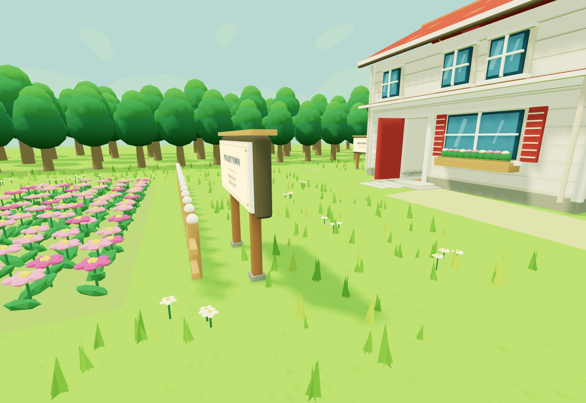
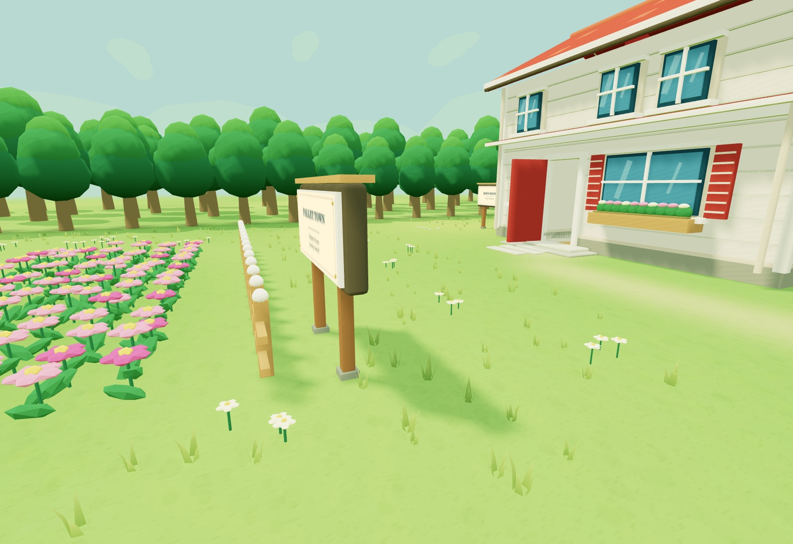
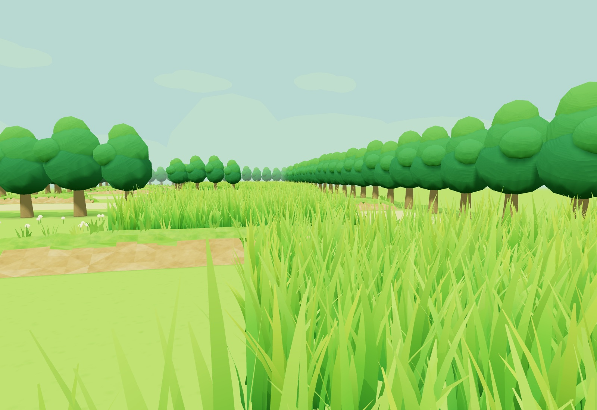
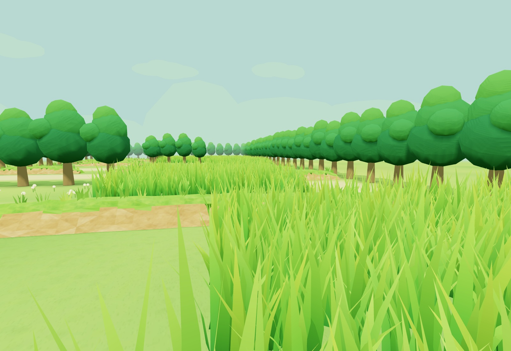
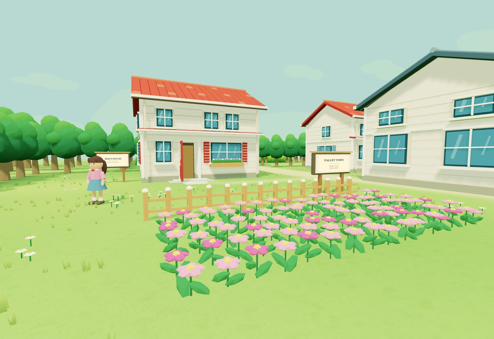
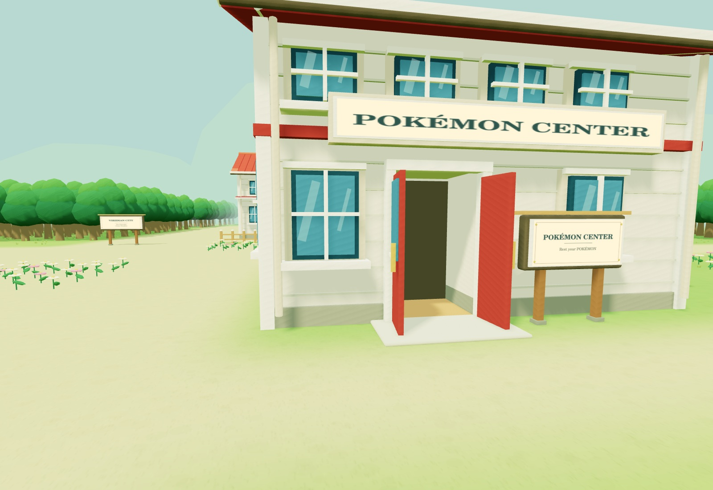

# Outdoor ground and grass polish — 6 September 2026

The outdoor pass improves the ground across Pallet, Route 1 and Viridian while
keeping the established warm, stylized architecture and map layout.
Build label: **KANTO 05 · OUTDOOR POLISH · 2026.09.06**.

## Visual changes

- One continuous turf surface replaces the flat lawn and separate hard-edged
  path overlays. Original trail polygons and route tiles are painted into a
  shared atlas with blended edges, subtle colour variation and fine ground grain.
- Flower beds blend into the lawn; darker turf around tree roots helps anchor
  the forest. The canonical flower arrangements remain intact.
- Pallet and Viridian's upright triangle grass becomes smaller, bent, tapered
  clumps with shaded roots and softer tips. There are fewer clumps, with better
  individual shapes.
- Route 1 retains every one of its 2,400 grass clump placements, the same height
  variation, colour gradients and wind animation. Three curved blade segments
  and a single pointed tip replace six segments. Slightly wider blades preserve
  coverage with 9–11 blades per clump instead of 11–13.
- The obsolete Pallet-only grass strip across the northern path is removed.
  Route 1's actual encounter-grass patches retain their existing positions.

People, interiors, doors, hands, Poké Balls, Pokédex, map boundaries, and controls
are unchanged. This is a surface/detail pass, not a new lighting or effects stack.

## Measured geometry and batching

Counts compare the actual assembled outdoor scenes before frustum/region culling.
They are not measured Quest frame rates. An instanced batch submits one draw,
while its triangle count includes all of its instances.

| Measure | Before | After | Change |
| --- | ---: | ---: | ---: |
| Route 1 tall-grass triangles | 345,648 | 120,020 | −65.3% |
| Tall-grass clumps | 2,400 | 2,400 | Same placements |
| Short-grass triangles | 5,938 | 19,728 | More detail per clump |
| Ledge triangles, including tufts | 13,669 | 13,669 | Same geometry |
| Ledge mesh batches | 145 | 24 | −83.4% |
| All outdoor triangles | 1,064,721 | 851,021 | −20.1% |
| All outdoor mesh batches | 642 | 501 | −22.0% |

Ledge faces merge by material, and their tufts instance across runs. The original
ledge builder is no longer constructed and immediately replaced at startup.
Grass chunk bounds now retain a margin for shader wind, preventing premature
culling of blade tips at the view edge. Existing fog and region culling remain.

The ground uses one 1024 × 2048 colour atlas and one repeating 512 × 512 detail
texture, about 12 MiB including mipmaps, replacing the previous roughly 1.3 MiB
ground texture. This deliberately trades a modest texture allocation and one
extra ground texture sample for softer surfaces and fewer overlapping meshes.
Both textures are generated once at startup; there is no per-frame canvas work.

## Validation

All 26 tests and the production build pass. New checks verify all 96 tall-grass
tiles retain 25 clumps each, enforce the reduced geometry budget, preserve the
ledge triangle count, and check wind-expanded instance bounds. The complete set
of 647 outdoor collision descriptions matches the previous build exactly.

Six matched before/after views of the actual meshes were inspected, including
Pallet's commons, a ground close-up, two Route 1 views, Viridian's Center and the
Pallet overview. These are offline OpenGL renders with approximate lighting;
they are not browser or Quest screenshots. Wind is frozen for comparison.
The cloud browser cannot run WebGL, and headset frame timing remains unmeasured.

## Previews

Pallet ground before:

Pallet ground after:

Route 1 grass before:

Route 1 grass after:

