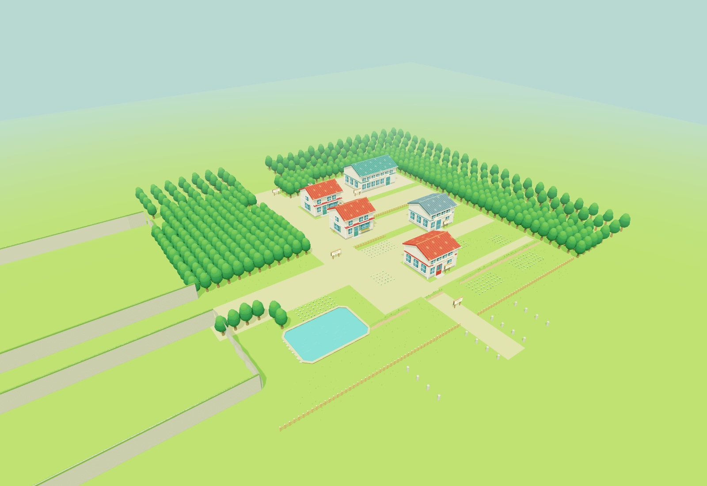
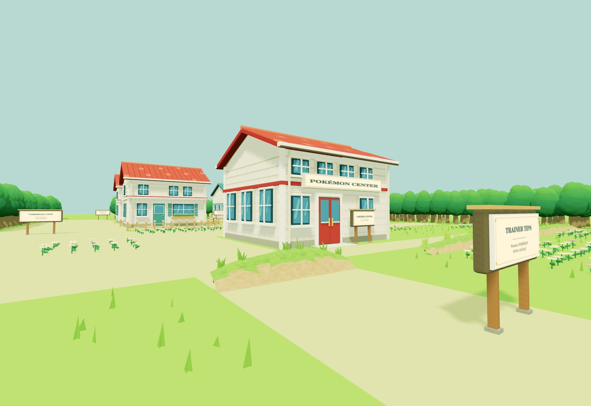
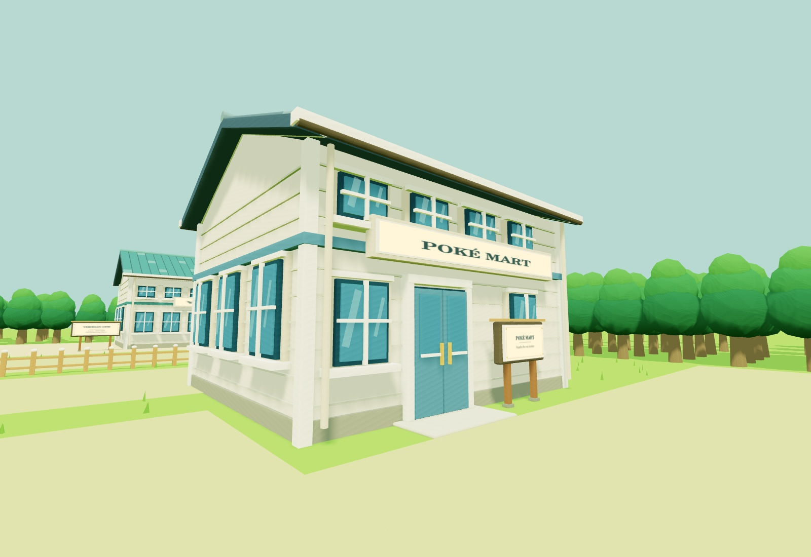
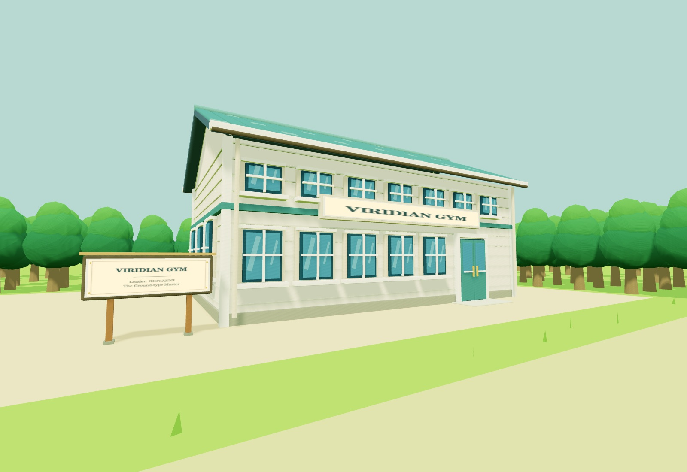

# Viridian City exterior pass — 6 September 2026

Historical notes for the exterior pass. All five buildings now have open
entrances and furnished rooms; see [the interior update](VIRIDIAN_INTERIORS.md).

Viridian City joins the **existing Route 1** at z = −90 in the same outdoor
scene. There is no area loading or relocation when walking into the city.
Pallet Town, its interiors, the recent window updates and Route 1 remain present.

Open the usual game and follow Route 1 north, or use
[the Viridian starting view](https://permabulk69420-pixel.github.io/Pokered/?start=viridian)
to start walking or enter VR at the city's southern approach.
The build label is **KANTO 03 · VIRIDIAN CITY · 2026.09.06**.

## Layout and style

The original Red/Blue 40 × 36 movement-tile map is interpreted at the existing
2 metres per tile. The source block map was reconstructed with its corresponding
blockset and tilesheet outside the repository to check the environment layout.
No source graphics or ROM content are bundled.

| Landmark | Original door tile |
| --- | --- |
| Pokémon Center | 23, 25 |
| Poké Mart | 29, 19 |
| School house | 21, 15 |
| Nickname house | 21, 9 |
| Gym | 32, 7 |

Six signs retain their source tile positions, with a small southward offset for
readability and clearance. The west escarpment, southwest pond, tree mass west
of the main street, northeast Gym yard, long fences, southern ledge gaps,
flower plots and south approach posts follow the original arrangement.
Route 2 and Route 22 have bounded entrance stubs for future extensions.

Building scale, siding, glazing, roof colours, roof tiles, rock faces and planted
flowers are remaster interpretations using Pallet's existing visual vocabulary.
The two houses reuse the Pallet house builder. Public buildings have individual
colours, signs, closed double doors and windows on every side. Terrain ledges
reuse the latest Route 1 geometry, procedural textures and rooted grass tufts.
New doors have solid collision and no interior triggers. No new NPCs are added.

## Verification

- All 18 tests pass, including the original 15 checks.
- New checks flood-fill the real combined world collision data from Route 1 to
  all five entrances, the pond clearing, Gym yard and both future route mouths.
- A swept movement check crosses the route/city seam; a pond check stops on land.
- Vite production build succeeds using the locked existing dependencies.
- Five views of the actual city meshes were rendered with native OpenGL and
  inspected: overview, map, south approach, Mart and Gym. This caught and fixed
  an inspection camera inside the Center and helped refine the pond/cliff edges.
- The city adds approximately 380,000 triangles before view culling. Architecture
  is merged by material; trees are instanced in spatial groups for view culling.
- The static shadow atlas moves between Pallet, Route 1 and Viridian only on a
  region change. Walking within a region reuses its shadow map.

The cloud browser reports WebGL disabled on the existing live game. Consequently
these previews are **offline renders of actual game geometry**, not browser or
Quest screenshots. Lighting is approximate, the background is simplified, and
there is no measured Quest frame-rate claim. An on-headset walkthrough remains
necessary to check stereo appearance and performance.

## References

- [Red/Blue Viridian object and sign coordinates](https://github.com/pret/pokered/blob/master/data/maps/objects/ViridianCity.asm)
- [Original block map](https://github.com/pret/pokered/blob/master/maps/ViridianCity.blk)
- [Original map connections](https://github.com/pret/pokered/blob/master/data/maps/headers/ViridianCity.asm)

