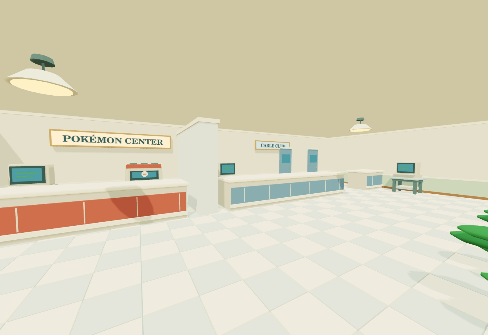
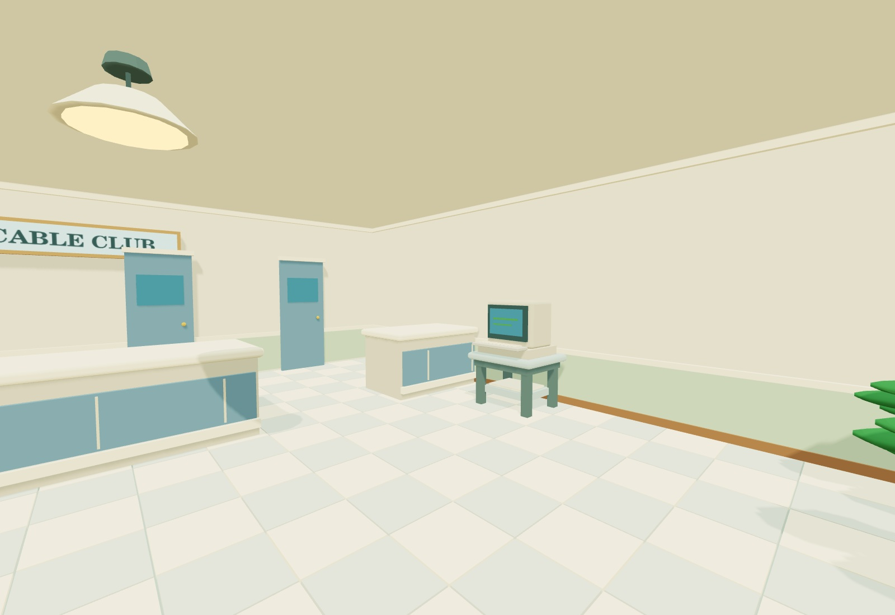
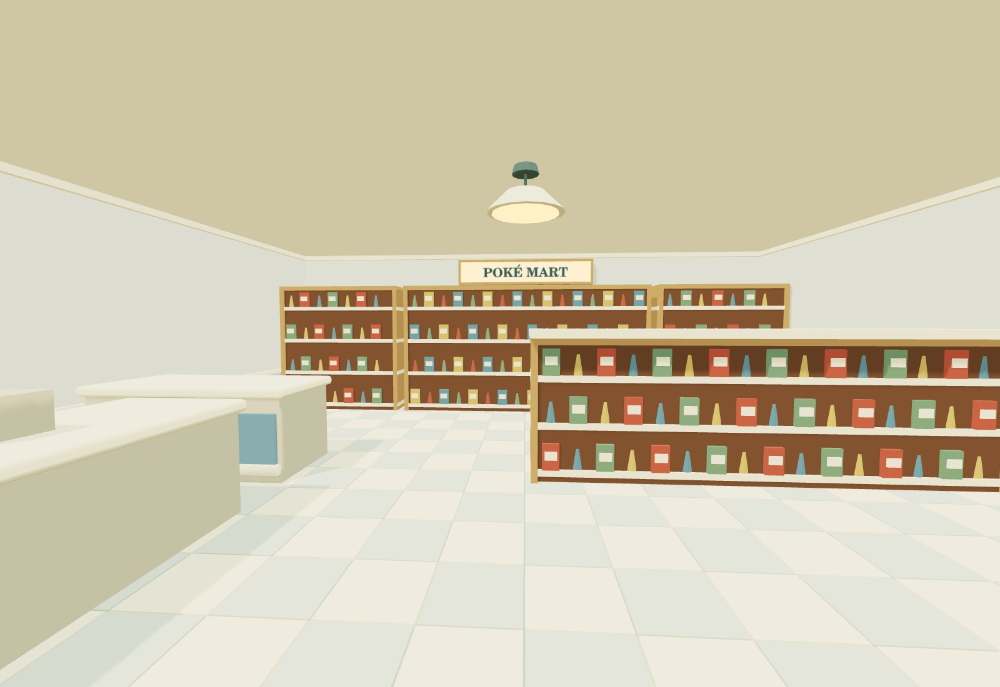
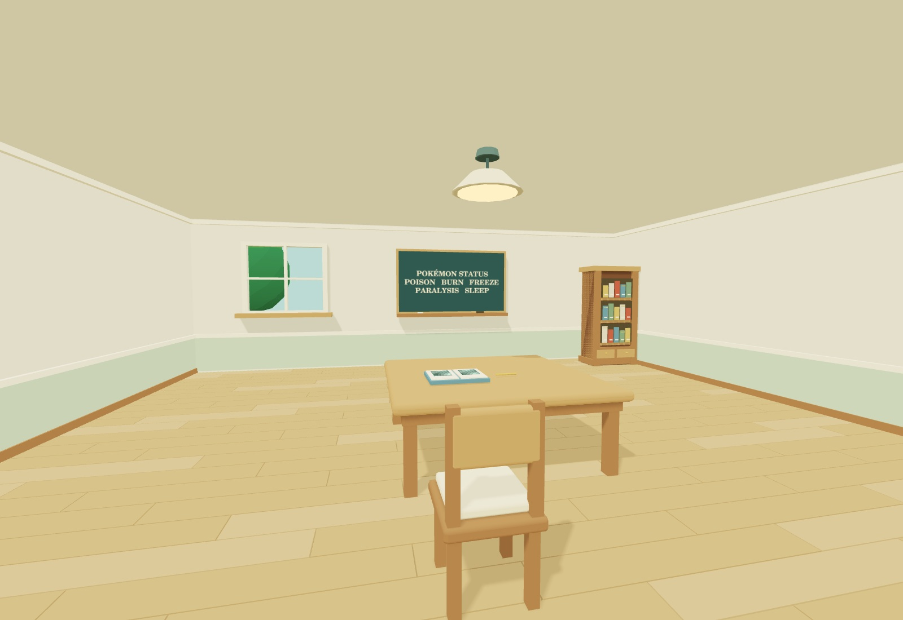
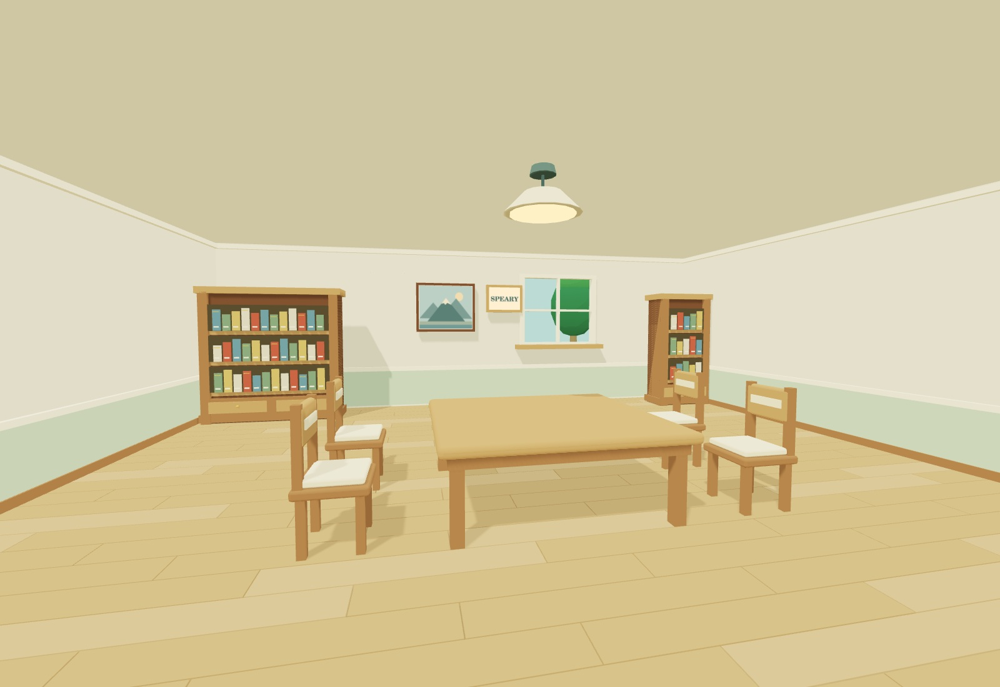
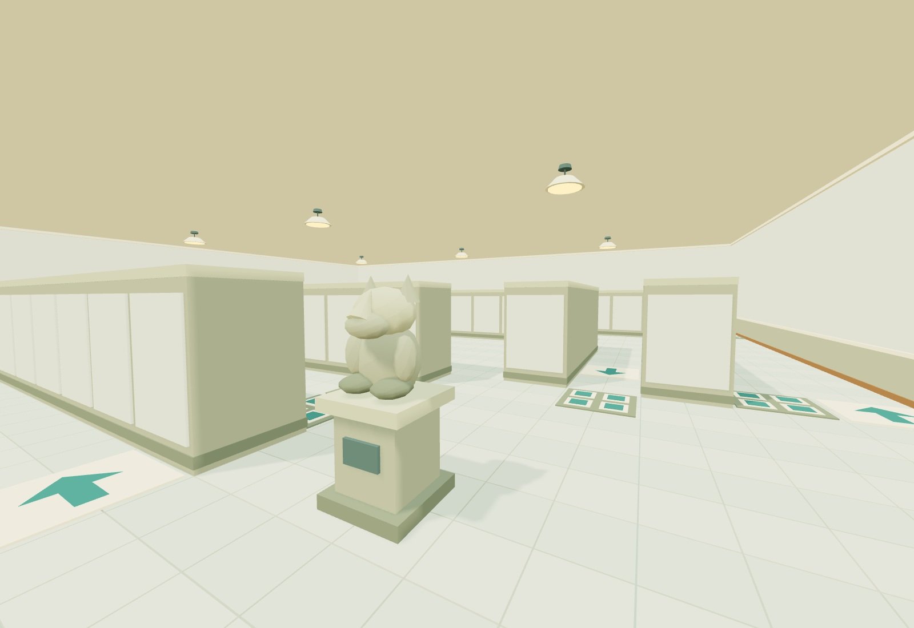
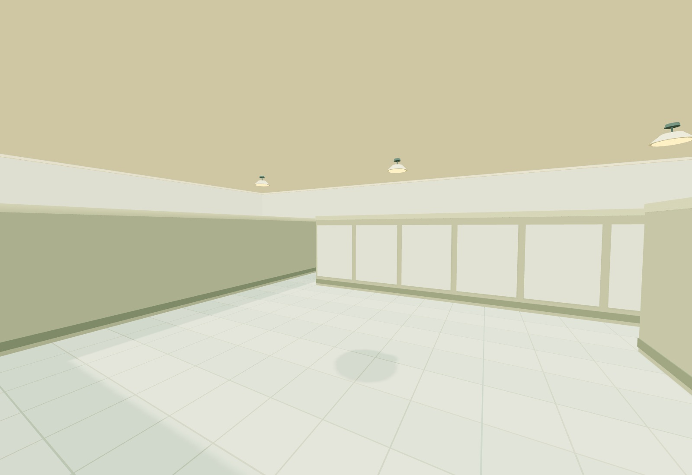

# Viridian interiors — 6 September 2026

All five existing Viridian buildings now have furnished interiors. Walk through
their open front doors and return through the same entrance, using Pallet's
existing short fade in both eyes. The new build label is
**KANTO 04 · VIRIDIAN INTERIORS · 2026.09.06**.

[Start in Viridian](https://permabulk69420-pixel.github.io/Pokered/?start=viridian).

## Original layouts, Pallet materials

Rooms use the original Red/Blue movement-tile maps at Pallet's existing indoor
scale of 1.2 metres per tile. The source block maps were reconstructed with their
corresponding blocksets and tilesheets in a temporary reference folder. No source
graphics or ROM assets are bundled. Architecture, furniture and lettering are
authored geometry and canvas textures using the existing interior palette.

| Room | Map size | Details carried into the remake |
| --- | --- | --- |
| Pokémon Center | 14 × 8 | Western healing counter, six-slot machine and console, split Cable Club counter, rear club doors, east public PC, west bench and southern plants |
| Poké Mart | 8 × 8 | Western clerk counter, north stock cabinets, central/east shelf bank and southern entrance |
| School | 8 × 8 | North window, status blackboard, northeast bookcase, central study desk and chair, notebook and southern plants |
| Nickname house | 8 × 8 | Northern bookcases, landscape picture, window and SPEARY plaque, central table with four chairs, southern plants |
| Gym | 20 × 18 | Original maze obstacles, arrow and stop tile positions, two entrance statues and southeast entrance |

Room heights, equipment shapes, shelf contents, tile finishes and human-scale
clearances are remaster interpretations. The houses reuse Pallet furniture,
wood floors and wall panelling. Their windows have real openings, clear glazing
and small outdoor tree scenes. Public rooms use pale tiles and cream counters
with red or blue accents. Gym barriers are stone partitions with inset panels.

This is an environment pass. There are no new residents, healing or shopping
systems, Cable Club rooms, or forced Gym movement. Arrows and stop tiles are
visual markings. Existing hands, Poké Ball models, Pokédex and outdoor region
culling remain in place.

## Verification

- All 23 tests pass, including the existing 18 navigation and scene checks.
- Every entrance is traversed with the real collision and transition lookup,
  followed by an indoor exit back to the correct building.
- Rays through all five exterior openings at knee and eye height confirm that
  no wall mesh blocks the actual doorway.
- Collision flood fills reach the furnished service areas and every walkable
  Gym tile; all solid maze tiles block movement.
- Room switching keeps only the active space visible and preserves accessories
  attached to the player rig. This is not a full gameplay interaction test.
- The production build passes with the existing locked dependencies.
- Seven views of the actual room meshes were rendered and visually inspected.
  The five new rooms total approximately 77,100 triangles before culling, with
  only the active room rendered. Static geometry is batched by material, using
  the existing interior lighting and shadow refresh on room changes.

These previews are **offline OpenGL renders of actual game geometry**, with
approximate lighting. The cloud browser has WebGL disabled, so they are not
browser or Quest screenshots. Stereo appearance and headset performance still
need an on-device walkthrough.

## References

- [Pokémon Center map](https://github.com/pret/pokered/blob/master/maps/ViridianPokecenter.blk) and [objects](https://github.com/pret/pokered/blob/master/data/maps/objects/ViridianPokecenter.asm)
- [Mart map](https://github.com/pret/pokered/blob/master/maps/ViridianMart.blk)
- [School map](https://github.com/pret/pokered/blob/master/maps/ViridianSchoolHouse.blk)
- [Nickname house map](https://github.com/pret/pokered/blob/master/maps/ViridianNicknameHouse.blk)
- [Gym map](https://github.com/pret/pokered/blob/master/maps/ViridianGym.blk), [arrow positions](https://github.com/pret/pokered/blob/master/scripts/ViridianGym.asm) and [source collision tiles](https://github.com/pret/pokered/blob/master/data/tilesets/collision_tile_ids.asm)

## Inspection views

Append `?view=viridian-center-interior`, `?view=viridian-mart-interior`,
`?view=viridian-school-interior`, `?view=viridian-house-interior`, or
`?view=viridian-gym-interior` to the game URL. Add `&clean` to hide the interface.

